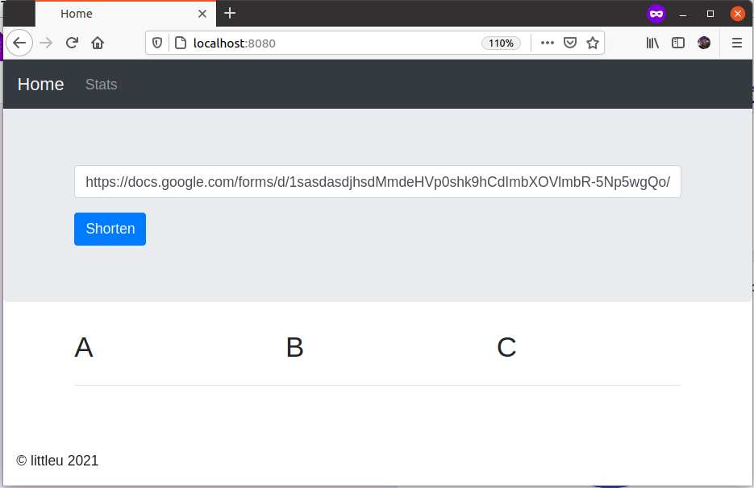
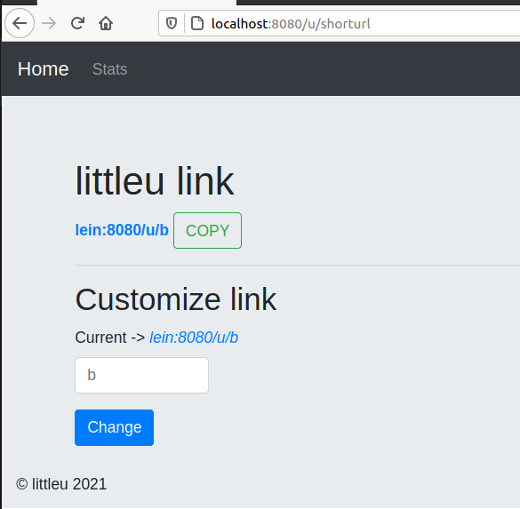

# littleu

**littleu** is a dummy/pet/small project to shorten long URLs written in Go.

After you shorten a URL it will look like this (might be changed)

## Objective

The objective of this project is just to have some fun 😃 and try to add valuable features
the best we can 😃

## Contributions

I am not the best Go programmer, and I won't be, I am 100% sure the code can always improve, I need your help on that, let's work together 😃

## Technical details

### Databases

littleu supports mongo, postgres and an "in memory" approach.
